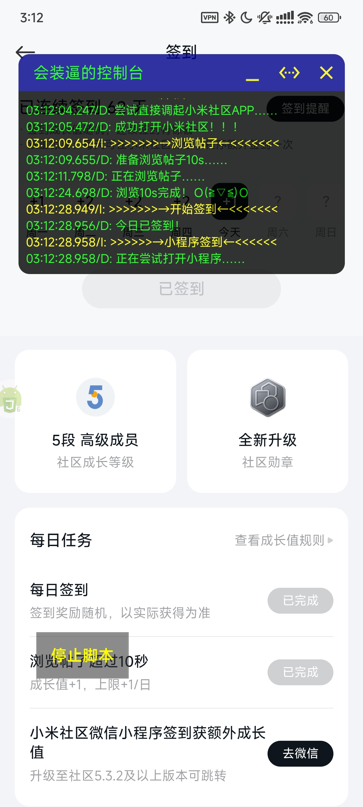
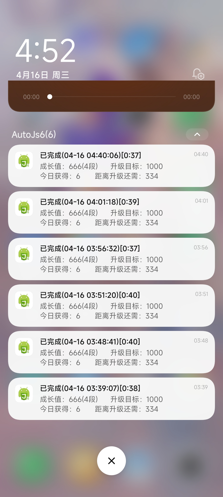

<div align="center">
<h1><a >小米社区自动化脚本</a></h1>

</div>

## **项目介绍**
#### 原作者：  @PJxiaoyu  
#### 修改： 风中拾叶 
#### 三改： wengzhenquan
* 此脚本是基于AutoJs6，依靠安卓无障碍服务的小米社区自动化脚本
* 区别于青龙面板，该脚本免登录，模拟真人操作，类似“按键精灵”、连点器APP。
* 支持的功能：
  * 定时解锁手机（密码，图案）
  * 浏览帖子
  * 签到验证码识别
  * 社区各种成长值任务
  * 小程序签到
  * 成长值记录
  * ......

* $\color{red}{如果担心使用脚本会导致黑号，请不要使用此脚本。}$  

---  
## **效果展示：**  
  
  
  


--- 
## **正式开始：**  
$\color{red}{（请看完下面使用方法，和常见问题。)}$    
（别问无效的问题，真是服了，有人没按照说明使用，下载了（不完整的）脚本，自己一顿瞎搞还来问）  
$\color{red}{(很多报错有中文提示，麻烦自己先看一眼。)}$
### 脚本下载：

[在线加速下载版（推荐）](https://github.com/wengzhenquan/autojs6/releases/main)  

[完整包下载](https://github.com/wengzhenquan/autojs6/archive/refs/heads/main.zip)   

   

### 文件结构：
```
/
├─ 【小社脚本】启动程序.js     (可独立运行)
├─ 【小社脚本】一键更新程序.js  (可独立运行)
├─ 【小社脚本】Run_x.x.x.js 
├─  config.js       # 配置文件
├─  version         # 版本信息
├─  tmp/            # 临时目录
└─  README.md       # 说明文档

  ---- (YOLO本地签到模块) ----  
  
└─ yolov11/     
    ├─ yolov11_w.js # 本地YOLO脚本
    └─ model/       # 模型文件目录
        ├─ yzm.bin
        └─ yzm.param
Yolo-Plugins.apk     # Yolo插件(需安装）
```       

旧版脚本使用一键更新程序.js方法：
``` 
1、下载【小社脚本】一键更新程序.js
2、确保version不存在(可删)
3、启动【小社脚本】一键更新程序.js
  这将会全量更新
```  

***主程序启动时，若需要切换历史版本，只需修改version文件的run值即可：***  
``` 
   
"run": "【小社脚本】Run_3.7.2.js",
   
```
每次更新将保留2个历史版本，多的会自动删除。
若想要保留，请自己重命名备份。

### **AutoJs6 $\color{red}{(建议使用最新版)}$：**    
（最低支持6.6.2，额外兼容6.5.0）   
（6.6.0是重构版，功能不完善、bug多，一直到6.6.2才恢复大部分）   
[点击下载](https://github.com/SuperMonster003/AutoJs6/releases)  


--- 
### **社区APP下载 $\color{red}{(支持跳转小程序版)}$ ：**  

[网盘下载](https://www.123912.com/s/RYmDVv-bwUch)  

[备用地址](https://www.123865.com/s/RYmDVv-bwUch)   


--- 
## 使用方法：  
### **1. 先授权AutoJs6需要的权限。**  

   免root建议`Shizuku`体验更好。  
   有root推荐授权root权限。  
   
   $\color{red}{最后一个(投影媒体)权限需要Shizuku或root才能开启！}$   
   
   页面需要的权限如下：
      
    
   * $\color{red}{额外权限： 后台弹出界面权限}$   
    
   ``` 
   小米手机：长按AutoJs6图标→应用详情→权限管理
            →其它权限→后台弹出界面。  
   Vivo、Oppo：听说有。
   其它手机：不知道，有些手机不需要手动打开这个权限，默认允许。 
   ```  
--- 
### **2. 更改autojs6工作路径。**  
     
    
   目录允许使用中文，在`sdcard/`路径下。  

--- 
### **3. 将脚本解压到工作路径下。**  

   你可以修改`文件夹`名称，里面的`文件`别改名就行。  
   
   * 只需 $\color{red}{【小社脚本】一键更新程序.js}$或者 $\color{red}{【小社脚本】启动程序.js}$文件，即可自动下载所有文件。
     * 若`version`文件存在：对比版本文件，增量更新。  
     * 若`version`文件不存在：全量更新。（可删除或者重命名）   
   * 两个文件都具有检查/更新功能。(但核心更新功能由`【小社脚本】一键更新程序.js`提供)    
   


--- 
### **4. 在AutoJs6找到脚本，脚本如下：**  
     

--- 
### **5. 编辑配置文件`config.js`：**  
     
    
   设置屏幕解锁密码，能够设置定时任务，
   在夜间自动解锁进行签到。

   * 配置文件里面都有详细说明：  
     解锁方式是上滑解锁，不影响指纹解、人脸解锁，只要存在上滑解锁方式即可。
     * **图案解锁：** 解锁方式：1
   
       ```
       依葫芦画瓢，有多少个点位，
       就多少行`[横坐标x, 纵坐标y]`。  
       按解锁顺序，从上到下排列。  
       ```
     * **数字(或混合)密码：** 将“解锁方式”改成2
       * $\color{red}{数字密码}$ ：“000000”改成你的数字密码
       * $\color{red}{混合密码(测试)}$ ：“000000”改成你的混合密码，仅支持 $\color{red}{数字和小写字母}$ 组合。
    
     * **没有密码：** 
       * 啥也不用管，程序会自动识别解锁状态。   
   
   * $\color{red}{图形锁的坐标获取方式：}$   
     * 方式一：开发者模式→指针位置(坐标绘制）
     * 方式二：(需要Shizuku或者root权限) 
   
       ```
       autojs6
         →左侧菜单（权限那一页）
         →浮动按钮（第3个），
           会看到一个悬浮小工具。  
       点击悬浮小工具
         →…(最后一个)
         →指针位置。    
       ```
           
    
--- 
### **~6. 小米社区小程序图标，必须放在桌面~**  
   **$\color{red}{（社区APP若支持跳转小程序，可忽略该操作）。}$**  
   
   
   在微信小程序里面，右上角“…”→添加到桌面，即可。  
   $\color{red}{不可藏在文件夹里！！！}$   
   ``` 
  
   坐标点击: 0,：（推荐）程序自动判断，若社区APP＞=5.3.2版本，使用社区跳转，否则使用桌面寻找图标。  

   坐标点击: 1,：（不推荐）从第3屏指定坐标点击启动小程序，坐标获取方法与上面一样。
              （如果你确定这样做了，那么图标必须放在第3屏！）  
              
   坐标点击: 2,：（推荐）强制使用桌面自动搜索所有屏。 
   
   ```   
   
   * 小米社区APP 5.3.2以上版本才支持从社区APP调用。  
   $\color{red}{页面开头已提供5.3.2以上版本下载地址}$  
   **页面开头已提供5.3.2以上版本下载地址**   
   
   ```
   注：桌面自动搜索功能，如果在桌面上存在多个[小米社区]图标（微信分身，或社区APP），那么会选择位置顺序靠前面的那一个。    
      如果打开了社区APP，会回到桌面，然后尝试打开下一个图标，直到打开小程序为止。    
      **调换图标位置，让小程序图标靠前，无疑可以加快流程耗时。**     
      或者把社区APP图标藏进桌面的某个文件夹里，让程序找不到。
   ```
--- 

### **7.完成！试跑！定时任务！**   
  * **$\color{red}{建议定时任务时间设在 3点以后}$**  
  * **$\color{red}{建议定时任务时间设在 3点以后}$**  
  * **$\color{red}{建议定时任务时间设在 3点以后}$**  
    * 遇到紧急更新，会在凌晨发布。   
      比如：小米社区APP控件更改，需要更新代码。   
    * 正常更新会在0点之前。   
    
   
  

  * 试跑：  
    配置好了以后，先试跑一下。   
    第一次试跑，把需要的权限都授权了。  
    确保脚本可以完成所有流程，然后设置定时任务。  
    **别忘了测试在锁屏状态下能否顺利解锁。**   
   ```  
    需保持 AutoJs6 后台运行, 
    包括 [ 自启动白名单 /
          忽略电池优化 / 
          忽略后台活动限制 / 
          系统多任务保留 ] 等.   
   ```  
   
   

  * **$\color{red}{执行过程可能发生错误。}$**  
    出现任何问题，先查看本页面(README.md文件)下方的 **问题收集** ，下面收录了大多数遇到的问题，并且同时也在更新。   
    
  * 保证全自动化进行，必须打开 **$\color{red}{“投影媒体权限”}$**！（shizuku或者root）   
   想流程减少错误，请确保AutoJs6拥有 **$\color{red}{“后台弹出界面”权限}$**！   
   （小米手机肯定有打开入口，其它手机自己找找，如果没有，就确保“悬浮窗”、“显示在应用上层”等权限都开启！）    
 
  * 调试成功后，建议设置 $\color{red}{2个定时任务}$，原因如下：   
    * 执行过程中可能发生错误。   
 
  * 程序运行耗时：50秒~2分钟  
    * 不会超过3分钟，超过肯定就是出错了，程序会强制停止  
    * 设置多个定时任务，间隔至少3分钟
 
 
--- 
### **10. 你还在等什么？哪来的8、9？赶快启动试试啊！成功了就定时任务甩起！**   
   
   一些额外辅助工具，正常都不需要用。
  
   www.123912.com/s/RYmDVv-A5uch
   
   提取码：GjHi
   
   

----   
## 问题收集：

### **1. $\color{red}{布局分析失效}$ 是什么意思？**   
   
   就是AutoJs6无法识别该页面的元素，比如“论坛”文本，“签到”按钮等等。  
   
   * 尝试开启：AutoJS6→设置→ $\color{red}{稳定模式}$→重启无障碍服务  
   
   * 尝试开启：config配置→ $\color{red}{fast模式: 改成1}$  
     (不一定有效，如果没问题不建议打开，打开说不定更差)
   
   
   ```    
   
   无法识别，也就无法判断这些元素是否已经加载、展示。  
   微信小程序里面，这个现象频发。   
   
   可能不兼容的因素：
     1、安卓版本
     2、AutoJS6版本
     3、微信版本(8.0.56开始的版本可能不兼容)
     
   跟脚本没关系，我只能改成用坐标点击，不能保证成功。
   如果想要避免，可以尝试更换上面几个软件的版本来解决。   
   
   注意：不一定高版本就好，尝试降低版本说不定有奇效。
   
   ```  
   
### **2. 为什么明明已经打开小程序，依旧报“ $\color{red}{进不了微信小程序，我尽力了！}$ ”？**  
   
   因为布局分析失效了，无法检测到小程序是否已经打开。   
    
   * `config.js`里，有个 $\color{red}{[跳过小程序打开验证 : 0]}$ 改成1即可。   
   
   * **若社区APP版本>=5.3.2，但无法跳转小程序（打不开小程序），**   
   需要强制使用桌面搜索小程序图标，可将`坐标点击：`改成2   
   
    
### **3. 什么是“ $\color{red}{排水沟过弯大法}$ ”？我的手机有时候无法启动小米社区？**
   $\color{red}{（缺少“后台弹出界面”权限）}$   
   
   
### **4.无法解锁屏幕/实际没有点击图标/实际没有点击……**  
   
   $\color{red}{重新授权“无障碍”权限，然后重启手机，即可解决。}$   
   ```
   锁屏无法上滑；
   日志提示已点击，但实际上没有点击
   （比如识图认证，从桌面打开小程序图标）。
   这些都是“无障碍”权限故障导致的问题。
   
   可能是刚升级AutoJS6，需要重新授权。
   也有可能，就是无障碍权限掉了……
   看下面问题5
   
   ```
### **5.无障碍服务已启用但未运行/无障碍服务老掉**  
   ```
   1、确保开启'忽略电池优化'
      [[ 自启动白名单 / 
         忽略电池优化 / 
         忽略后台活动限制 / 
         系统多任务保留 ] 等.]
   2、重启无障碍服务
   3、重启手机
   ```
   
   若有高级权限：（shizuku或者root）  
   ```
   AutoJS6→设置：
     1、使用修改安全设置权限自动启用无障碍服务
       →开启【修改安全设置权限】
     2、使用root权限自动启用无障碍服务
   ```
   若有墓碑、杀后台程序，可以尝试加入白名单。    
   可以尝试第三方无障碍管理器用来保活，比如： $\color{red}{无障碍管理器}$ （酷安搜索，或上面第10步网盘链接有）   
   
   
### **6.为什么我按[音量+/-]键无法停止脚本？**  
   听说， $\color{red}{重启手机}$ 会有效果，一般人我不告诉他！
   
   ```  
   原因1： 监听音量键被占用。
        可以尝试AutoJs6→设置→打开“音量加”键控制脚本。
        开启、关闭，这个功能，尝试在开关这个按钮的情况下，脚本是否有效。
        反正我代码里面写了。
        被听音乐APP、看视频APP占用。
        被AutoJs6本身占用，也有可能无法激活。
        
   原因2： 可能被手机厂商限制监听功能。
        比如在小米澎湃2的环境下，该功能可能就失效。
        目前还没实现通过广播功能实现监听。
   
   ```
   
### **7.为什么我点击`【停止脚本】`按钮无法停止脚本？显示“ $\color{red}{关不掉！x1}$ ”。**  
   点击已经成功了， $\color{red}{继续点击}$ ，你一定可以停止成功的。
   
   ```  
   原因： 我也不知道为什么，应该是AutoJS6设计上的问题，
         停止不能强制执行，只能通知式执行。
         在某些操作正在执行的时候，可能无法停止。
         最终结果不能确定。
         反正失败了就继续点就是。
         
   ```
   
### **8. $\color{red}{要开始使用AutoJs6录制或投放内容吗？}$ 每次需要手动点“立即开始”。**  
     
   $\color{red}{需要开启“投影媒体权限”，才能自动跳过这一步。}$  
   
   ```
   免root用户(有电脑)：下载adb工具，复制开启“投射媒体权限”的命令执行，相关过程自行查询。  
   
   免root用户(有Shizuku)：AutoJS6获得Shizuku授权，点击开启按钮，可直接开启。  
   
   root用户：AutoJs6获得root权限，点击开启按钮，直接开启。  
   ```
   **等等，我的AutoJs6没有这个选项？**  
   啊！你用的是什么古老版本？   
   ```
   如果不想升级AutoJs6？怎么开启“投射媒体权限”？   
   （免root用户可以借助 `Shizuku + APP ops`这款APP。）   
   （root用户可以借助 `Thanox`这款APP。）    
    (上面使用步骤10的链接里面，已上传这两款APP。)   
   ```
   
### **9. $\color{red}{方法images.requestScreenCapture()}$  调用失败。**  
   （截图权限无法通过）
   
   这是 $\color{red}{“投影媒体权限”}$ 获取异常导致的。
   尝试以下方法之后，再运行脚本。 
   ``` 
   1、检查“`投影媒体权限`”，是否开启。
   2、重启AutoJs6。
   3、重启手机。
   ``` 
   经过我多次尝试，直接重启手机无疑是最有效的。  
   再添加一个定时任务很有必要，间隔3分钟以上即可。    
   这是偶然现象，长时间息屏的情况下，可能无法立刻激活手机。  
   第二次执行不会再出现。    
   
   
### **10. $\color{red}{缺失yzm.bin、yzm.param文件}$**  
    **$\color{red}{/Yolo-plugin.apk插件未安装}$** 
   
     
   这些是本地YOLO支持的文件。    
   目录结构本页上方（下载链接）位置有说明。   
   
   ``` 
   当然，如果你坚持使用服务器方式识图签到，可忽略该报错。 
   (将配置文件"本地YOLO识图: 1,"改成0，就不会提示)  
   本地YOLO加载失败的情况下，依旧使用连接服务器方式识图签到。   
   ``` 
   
   ***如果Yolo-plugin.apk已安装，依旧提示未安装，看下面问题11。***  
   
### **11. $\color{red}{方法plugins.load调用失败}$。**  
   
   就是 $\color{red}{ Yolo-plugin.apk未安装。}$ 
     
   `什么？已经安装了还是报这个错误？`   
   那你一定是root用户，且使用了`隐藏应用列表`。   
   将 Yolo-Plugins 加入白名单，让AutoJS6对其可见即可。  
   AutoJS6不要使用6.6.0、6.6.1版本，有bug。     
   
   
### **12.更新的时候，一大堆报错， $\color{red}{OOM}$。**   
   * OOM：内存溢出（AutoJS6内存不足)    
       * 并不是手机内存不足，只是AutoJS6自己限制了可用内存。    
       * 下载大文件的时候，没能及时释放内存，就有可能出现OOM。
   ``` 
   
   解决：AutoJS6左边菜单，最下面→重启
        只要关闭重启AutoJS6即可
        
   ```  
   
### **13. $\color{red}{打开应用详情页失败了！}$**  
   
   无障碍权限掉了，关闭无障碍权限，重新授权开启一下。
   
### **14. 启动不了。日志只有“开始运行”、“结束运行”。**  
   
   删除tmp目录下的以下文件，或者删除tmp/一整个文件夹：
   ``` 
   
   launch_main_locked
   update_locked
   
   ``` 
   
   

--- 
## 作者的废话：
   ```
   多次测试，中途遇到各种意外不能执行下去，都写了补偿方案，实现plan B。  
   
   原本600多行的代码，扩写到了2000多行。
   能够兼容大部分机型，兼容大部分安卓版本，减少错误率。   
   即便不是小米手机，也无所畏惧。
   
   不论如何，我的建议是设置两个定时任务。  
   间隔3分钟以上（正常走完一次，2分钟内能执行完毕）。  
   多次执行，就不怕漏签了。  
   
   ```
  
   
--- 


原作者  by：PJ小宇    QQ：898811295

修改    by：风中拾叶

三改   by：wengzhenquan（就是俺啦）   
github：https://github.com/wengzhenquan/autojs6


--- 
v3.7.7：
1. 不再支持6.6.0、6.6.1版本
2. 一些优化

v3.7.6:
1. 修改日志颜色
2. 优化部分代码


v3.7.5:
1. 修复活动不存在时，流程卡住
2. YOLO运行结束时释放资源
3. 优化加速代理


v3.7.4:
1. 修复双旗舰活动，第二次开盒报错null clickable();
2. 优化当本地YOLO签到失败后，使用服务器签到方案。
3. 支持混合密码解锁
4. 一些优化

v3.7.3:
1. 优化社区APP→签到→确认，确认按钮无法识别
2. 添加“坐标点击：2”，强制使用桌面搜索图标
3. 修复文件校验报错
4. 增强界面确认

v3.7.2:
1. 兼容小米社区APP5.4.4
2. 彻底解决，记录成长值前跳出“屏幕录制”停止提示
3. 修改微信小程序抹黑签到坐标
4. 修复更新时间长，脚本提前终止问题
5. 优化http请求超时
6. 保留3个历史版本的run文件  
``` 
若需要切换版本，只需修改version文件的run值即可。
"run": "【小社脚本】Run_3.7.2.js",
```

v3.7.1:
1. 修复卡在签到页问题
2. 修复，提前停止屏幕保护导致无法记录成长值
3. 下载非文本文件，添加SHA-1文件校验
4. 更换优质代理加速下载

v3.7:
1. 修复文件检查，缺失文件列表bug
2. 一键更新程序添加脚本完整性检查
3. 配置添加`本地YOLO识图`开关
4. 配置添加`fast模式`开关，开启控件缓存
5. 主程序脱离config.js依赖，单文件独立运行

v3.6.3:
1. 解除更新脚本对version文件的依赖，若不存在version全量更新
2. 优化从微信进入小程序滑动坐标
3. 屏幕解锁兼容性提升
4. 悬浮窗关闭按钮提前展示
5. 装逼控制台字体大小缩小为15
6. 添加[音量-]停止脚本(不保证兼容性)
7. 自动将旧配置内容，更新到新配置文件

v3.6.2:
1. 启动程序和逻辑脚本分离，更新版本定时任务不必再重新设置。    
   （将`【小社脚本】启动程序.js`设为定时任务，更新版本也不会改名）
2. 完善一键更新程序。
3. 兼容性优化。
4. 添加脚本完整性检查。
5. `version`文件添加启动程序文件配置。
6. 只需`version`、`【小社脚本】一键更新程序.js`就能下载一整个完整脚本。   
(更新，`【小社脚本】一键更新程序.js`，`小社脚本.3.6.2.js`(下个版本将抛弃），`【小社脚本】启动程序.js`，`【小社脚本】Run_3.6.2.js`)


v3.6.1:
1. 修复社区APP签到无法提交。
2. 配置文件，[检查更新]新增2→自动更新
3. 一键更新程序更新，以及改名。
(更新，`【小社脚本】一键更新程序.js`、`小社脚本.js`、`config.js`、`version`)


v3.6:
1. 添加检查更新功能，支持打印增量更新清单
2. 添加社区签到关闭开关
3. 修复部分bug
4. 整理代码
5. 一键增量更新程序.js
(更新：小社脚本.js、config.js、yolov11_w.js、version文件、小社脚本（一键增量更新程序.js)


v3.5.1:
1. 将无法识别的图片，分类保存到`tmp/error/`目录下
2. 添加识图签到坐标识别错误重试3次
3. 改名yolov11.js为yolov11_w.js，与原版共存


v3.5:
1. 支持本地YOLO模型识图签到   
(保留服务器识图签到，兼容旧版）  


v3.4:
1. 添加异常打印输出。  
2. 优化小程序摸黑签到逻辑。
3. 添加通知静音、结束震动配置。
4. 添加小程序摸黑签到自定义坐标。
5. 删除已弃用的配置，con、totaltime，这两货在程序里也是没用的一段代码。


v3.3:
1. 添加设置媒体静音功能。   
2. 添加设置运行屏幕亮度功能。   
3. 修复小程序布局分析失败时，卡主问题。   
4. 添加布局分析失败，从社区APP重新打开逻辑。   
5. 调整运行顺序：   
    APP签到完→小程序签到（去除小程序成长值统计）；  
    开盒子放到最后，以免小程序签到完，成长值又足够开盒子；  
    成长值数据，只用社区APP统计，放在程序最后，以免小程序统计不准确；  
(看起来好乱！)


v3.2.1:
1. 调整控制台，在签到页控制台高度收缩为20%，签到完成恢复。 
2. 等待小程序打开时间延长到10秒。 
3. 请求服务器超时改为10秒，且添加@风中拾叶大佬的请求地址。   
4. 服务器部分优化，加快请求速度。  
5. 主程序改名为“小社脚本”，就是“小（米）”、“社（区）”各留第一个字。  
(改名主要是看到风中拾叶的脚本开始用跟本脚本一样的命名规则，加个v，这样就不好共存了啊！)  

v3.2:
1. 延长从社区APP调用小程序的等待时间。
2. 终于实现识图签到了，是风中拾叶写的Python，和训练的模型。
（几经波折，由于AutoJS6不支持调用模型，所以最后把模型放在了服务器上跑，需要请求服务器，需要4~7秒的时间。）
（虽然删除了hk目录，但是滑块签到的逻辑还是保留的，转移到tmp路径，反正已经实现自动适配了。说不定哪天小米又换过来了呢？）
（感谢@风中拾叶 大佬（@fgvsuiye）的辛苦奉献）


 [更新历史](说明/更新历史.md)
